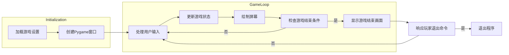
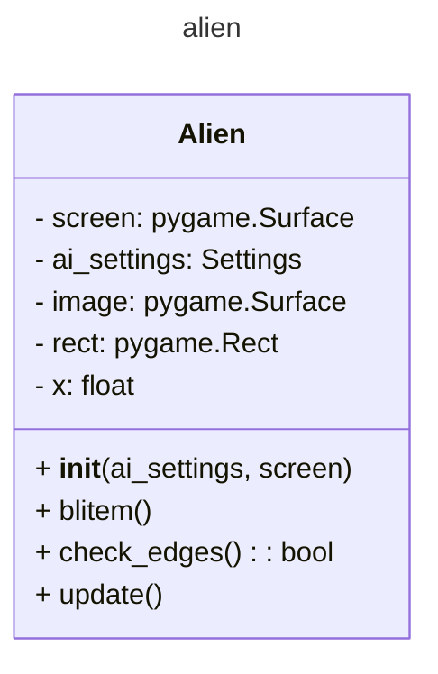
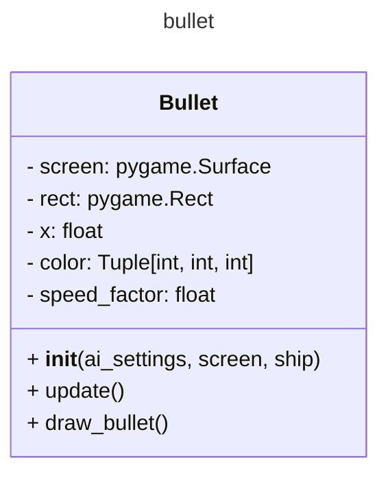
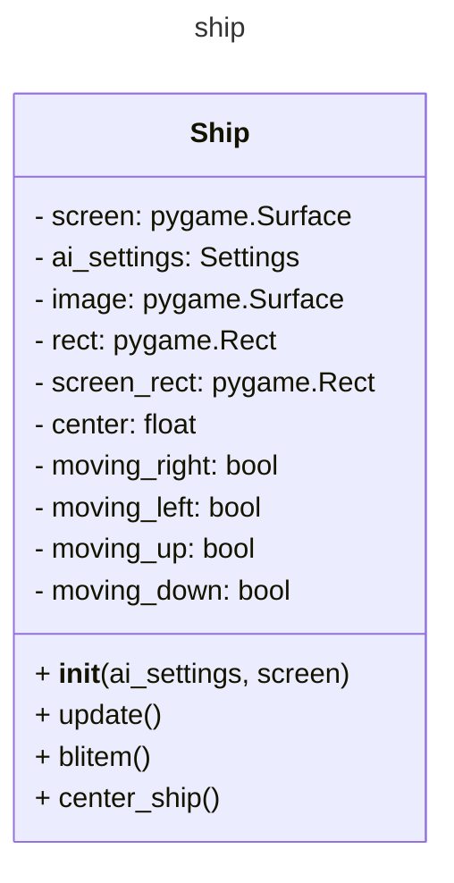
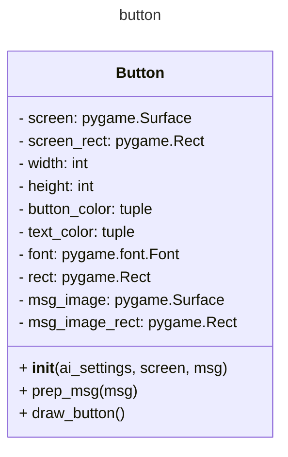
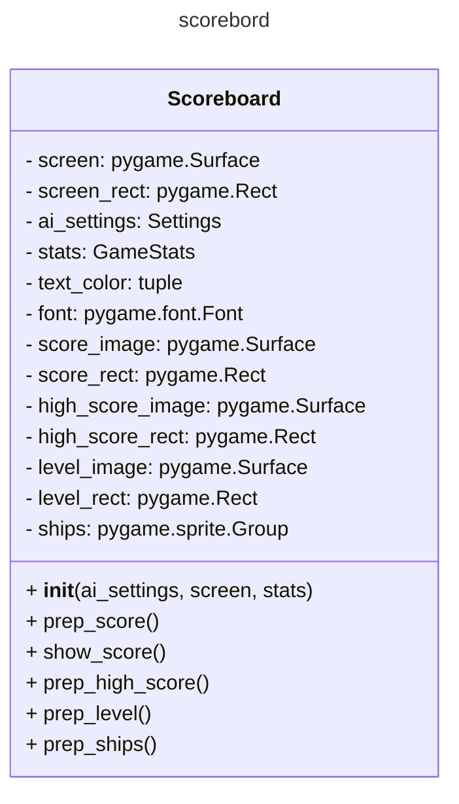
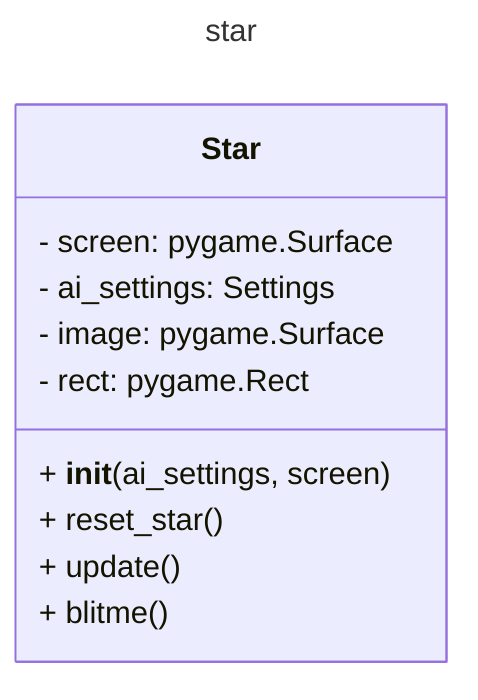

# 《Python程序设计基础》程序设计作品说明书

题目： 项目1： 外星人入侵游戏👽

学院： 21计科02

姓名：刘培钰

学号： B20210302226

指导教师： 周景

起止日期：2023.11.10-2023.12.10

## 摘要

 本次设计完成了《外星人入侵游戏》项目，这是一款基于Python编程语言和Pygame库开发的2D射击游戏。游戏背景设定在太空，玩家需要驾驶飞船与入侵的外星人展开激烈对抗。通过巧妙设计的游戏机制、精美的图形，以及简单直观的操作方式，提供了一场充满挑战和娱乐的游戏体验。在此次项目中，首先，通过Python编程语言建立了游戏的基本框架，随后利用Pygame库处理游戏中的图形、声音等方面的功能。详细介绍了飞船和外星人的设计与实现，以及游戏中的各种元素，如子弹、分数计算等。通过游戏循环的设计，实现了游戏的持续进行，直到玩家胜利或失败。我完成了游戏项目的整体设计和编码工作。包括创建游戏窗口、定义飞船和外星人的属性与行为、处理用户输入、实现游戏逻辑循环等。通过调试和优化，确保游戏的流畅运行和良好的用户体验。

关键词：Python、Pygame、飞船与外星人

## 第1章 需求分析
功能：
1. 创建游戏窗口、添加飞船图像、驾驶飞船、飞船可以射击子弹。
2. 创建一群外星人、外星人可以移动、可以射杀外星人、结束游戏。
3. 添加Play按钮、可以提高等级、计分功能。
4. 将飞船放在屏幕左侧进行射击
5. 在游戏背景中随机位置绘制星星
6. 将游戏中得到的最高分保存到文件中


## 第2章 分析与设计

#### 系统架构
1. 游戏初始化：

- 窗口设置： 使用Pygame库创建游戏窗口，设置窗口大小、标题等。
- 游戏参数初始化： 初始化游戏设置，如飞船速度、子弹速度、外星人移动速度等。
2. 游戏图形界面：

- 背景绘制： 在游戏窗口中绘制太空背景，营造游戏场景。
- 角色绘制： 绘制玩家飞船、外星人、子弹等游戏元素。
3. 用户输入处理：

- 键盘事件监听： 监听玩家在游戏中的键盘输入，包括移动、射击等操作。
- 事件响应： 根据用户输入触发相应的游戏事件，如飞船移动、发射子弹等。
4. 游戏逻辑：

- 飞船控制： 根据用户输入控制飞船的移动，确保飞船在屏幕范围内活动。
- 外星人控制： 控制外星人的生成、移动和消失，增加游戏难度。
- 碰撞检测： 检测飞船、子弹与外星人之间的碰撞，触发相应的游戏反馈。
- 计分系统： 根据击毁外星人等行为更新玩家得分。
5. 游戏循环：
- 主循环： 游戏核心循环，保持游戏持续进行。
- 更新屏幕： 每轮循环更新游戏界面，包括角色位置、得分等。
- 事件处理： 处理用户输入和游戏事件，更新游戏状态。
6. 游戏结束处理：

- 胜利条件： 根据游戏规则设定胜利条件，玩家达成即可获胜。
- 失败条件： 玩家未能在规定时间内完成目标或被外星人撞击，判定为失败。
7. 优化与调试：

- 性能优化： 确保游戏流畅运行，避免卡顿和延迟。
- 调试处理： 检测和修复潜在的错误，确保游戏的稳定性。
#### 系统流程
1. 初始化游戏设置和屏幕

- 加载游戏设置，如屏幕尺寸、飞船速度等。
- 创建Pygame窗口。
2. 创建游戏主循环

- 进入游戏的主循环，不断执行直到玩家选择退出。
3. 处理用户输入

- 监听并响应用户的按键和鼠标事件。
- 根据用户输入更新飞船的位置。
4. 更新游戏状态

- 更新飞船、外星人和子弹的位置。
- 检查碰撞，如子弹击中外星人、外星人触碰飞船等。
- 生成新的外星人群，提高游戏难度。
5. 绘制屏幕
- 在每次循环中绘制飞船、外星人、子弹以及游戏统计信息。
- 刷新屏幕显示。
6. 检查游戏结束条件
- 如果外星人触碰到屏幕底部或者飞船耗尽所有生命，游戏结束。
- 显示游戏结束画面
显示游戏结束的相关信息，如得分、最高分等。
7. 响应玩家的退出命令
- 如果玩家选择退出，结束游戏循环，退出程序。
##### 流程图

  
#### 系统模块
- alien_invasion.py模块
```
1、初始化和设置：
模块开始时，将当前工作目录更改为脚本的目录。使用 Pygame 初始化 (pygame.init())，并导入必要的模块和类。

2、游戏设置：
使用 Settings 类（来自 settings 模块）存储和管理游戏设置。

3、屏幕和界面元素的创建：
创建了一个 Pygame 屏幕对象，并设置了游戏窗口的标题。创建了一个 Button 对象，表示游戏中的“Play”按钮。实例化了存储游戏统计信息的 GameStats 类和创建计分牌的 Scoreboard 类。

4、游戏元素的初始化：
创建了玩家飞船对象 ship，用于控制玩家在游戏中的移动。创建了存储子弹的编组 bullets、存储外星人的编组 aliens 和存储星星的编组 stars。使用 gf.create_stars 初始化星星群。

5、游戏循环：
进入了主游戏循环，通过 while True 进行持续运行。
使用 gf.check_events 处理用户输入事件。在游戏激活状态下，通过调用不同的游戏函数（例如 ship.update、gf.update_bullets、gf.update_aliens）更新游戏元素的状态。使用 gf.update_screen 更新屏幕显示，包括绘制飞船、子弹、外星人、星星和计分牌等。在游戏不活动时，保存最高分。

6、算法和数据结构：
游戏逻辑主要通过调用 game_functions 模块中的函数实现，涉及到事件处理、更新游戏元素状态和屏幕显示等。

7、库的使用：
使用 Pygame 库来处理游戏的图形界面、事件处理和游戏循环等方面。 Pygame 提供了处理游戏开发中常见任务的功能。
```
- game_function.py模块
```
1、处理按键按下事件，根据按键的不同进行相应的操作，例如移动飞船或发射子弹。处理按键松开事件，停止相应的操作，例如停止飞船的移动。发射子弹，创建新的子弹对象并将其添加到子弹编组中。

2、处理所有的事件，包括按键事件和鼠标事件。调用其他函数来具体处理不同的事件。在玩家点击play按钮时开始新游戏，包括重置游戏设置、统计信息、创建新的外星人群等。更新屏幕上的图像，包括绘制飞船、外星人、子弹、星星以及显示得分等。更新子弹的位置，并检查子弹与外星人的碰撞，以及处理相应的逻辑。
响应子弹和外星人的碰撞，更新得分和检查最高分。

3、计算每行可容纳多少个外星人。 计算屏幕可容纳多少外星人的行数。创建一个外星人，并将其放入当前行。创建外星人群。确定是否有外星人位于屏幕边缘，有的话改变它们的方向。将整群外星人下移，并改变它们的方向。处理飞船被外星人撞到的情况，包括减少飞船数量、更新得分、清空外星人和子弹列表等。检查是否有外星人到达了屏幕底端。更新外星人的位置，并检查外星人与飞船的碰撞，以及处理相应的逻辑。

4、创建多个星星并添加到星星编组中。更新多个星星的位置，移除到达底端的星星，并添加新的星星以保持星星数量不变。检查是否有星星到达了屏幕底端。

```
- setting.py模块
```
1. 外星人设置：
alien_speed_factor: 控制外星人的移动速度。
fleet_drop_speed: 控制外星人群向下移动的速度。
fleet_direction: 1 表示向右移动，-1 表示向左移动。
2. 子弹设置：
bullet_speed_factor: 控制子弹的移动速度。
bullet_width 和 bullet_height: 分别为子弹的宽度和高度。
bullet_color: 子弹的颜色。
bullets_allowed: 限制同时存在的子弹数量。
3. 屏幕设置：
screen_width 和 screen_height: 分别为屏幕的宽度和高度。
bg_color: 屏幕的背景颜色。
num_stars: 星星的数量。
star_speed: 星星的移动速度。
star_points: 星星的得分。
4. 飞船设置：
ship_speed_factor: 控制飞船的移动速度。
ship_limit: 允许的飞船数量。
5. 游戏节奏设置：
speedup_scale: 控制游戏节奏加快的比例。
score_scale: 控制外星人点数增加的比例。
6. 初始化和动态设置：
initialize_dynamic_settings(): 初始化随游戏进行而变化的设置。
increase_speed(): 提高速度和外星人点数设置，实现游戏的难度逐渐增加。
```
- alien.py模块
```
1、外星人初始化：
__init__ 方法初始化外星人对象，加载外星人图像，设置初始位置，并存储外星人的准确位置。
外星人绘制：
blitem 方法在指定位置绘制外星人。
2、边缘检测：
check_edges 方法检查外星人是否位于屏幕边缘，如果在边缘则返回 True。
外星人移动更新：
update 方法根据 fleet_direction 向右或向左移动外星人。
算法
3、初始化位置：
外星人的初始位置为屏幕的随机水平位置，纵坐标设置为外星人的高度。
边缘检测：
使用 check_edges 方法检测外星人是否到达屏幕边缘，以确定是否改变移动方向。
4、外星人移动：
根据 fleet_direction 的值，更新外星人的 x 坐标，实现向右或向左移动。
结构
```

- bullet.py模块
```
1、子弹初始化：
__init__ 方法在飞船位置创建一个子弹对象，设置矩形区域、位置、颜色和速度等属性。
子弹移动更新：
2、update 方法向上移动子弹，更新子弹的位置。
绘制子弹：
3、draw_bullet 方法在屏幕上绘制子弹。
```

- ship.py模块
```
1、飞船初始化：
__init__ 方法初始化飞船对象，加载飞船图像并获取其外接矩形，设置初始位置和移动标志等属性。
飞船移动更新：
update 方法根据移动标志调整飞船的位置，限制飞船的活动范围。
2、绘制飞船：
blitem 方法在指定位置绘制飞船。
3、居中飞船：
center_ship 方法让飞船在屏幕上居中。
```

- button.py模块
```
1、按钮初始化：
__init__ 方法初始化按钮的属性，设置按钮的颜色、文本颜色、字体等，创建按钮的矩形区域，并将按钮的标签渲染为图像。
2、按钮文本渲染：
prep_msg 方法将按钮的标签渲染为图像，并使其在按钮上居中。
3、绘制按钮：
draw_button 方法绘制一个颜色填充的按钮，再绘制按钮上的文本。
```

- scorebord.py模块
```
1、初始化得分板：

__init__ 方法初始化显示得分板的属性，包括屏幕、游戏设置和统计信息。
准备好初始得分、最高得分、等级和剩余飞船的图像。
2、准备得分图像：
prep_score 方法将得分转换为一幅渲染的图像，包括圆整得分、添加逗号千分位分隔符，然后将图像放在屏幕右上角。
3、显示得分：
show_score 方法在屏幕上显示得分板，包括得分、最高得分、等级和剩余飞船。
4、准备最高得分图像：
prep_high_score 方法将最高得分转换为渲染的图像，添加逗号千分位分隔符，然后将图像放在屏幕顶端中央。
5、准备等级图像：
prep_level 方法将等级转换为渲染的图像，然后将图像放在得分下方。
6、准备飞船图像：
prep_ships 方法显示还剩下多少艘飞船，创建飞船对象，并设置它们的位置。
```

- star.py模块
```
1、初始化星星：
__init__ 方法初始化星星的属性，包括屏幕、游戏设置和星星图像。
加载星星图像，缩放图像并设置星星的初始位置。
2、重置星星位置：
reset_star 方法将星星放到屏幕上随机位置。
3、更新星星位置：
update 方法更新星星的位置，使其下落。
如果星星到达屏幕底部，重新放置到屏幕顶部。
4、绘制星星：
blitme 方法在指定位置绘制星星。
```

## 第3章 软件测试
1. alien.py
   
单元测试：
```git
import unittest
from unittest.mock import Mock
from alien_invasion import Alien 

class TestAlien(unittest.TestCase):
    def setUp(self):
        pygame.init()

    def test_initialization(self):
        ai_settings = Mock()
        screen = Mock()

        alien = Alien(ai_settings, screen)

        self.assertGreaterEqual(alien.rect.x, 0)
        self.assertLessEqual(alien.rect.x, ai_settings.screen_width - alien.rect.width)
        self.assertEqual(alien.rect.y, alien.rect.height)
        self.assertIsInstance(alien.x, float)

    def test_check_edges(self):
        ai_settings = Mock()
        screen = Mock()

        alien = Alien(ai_settings, screen)

        self.assertFalse(alien.check_edges())

        alien.rect.right = ai_settings.screen_width
        self.assertTrue(alien.check_edges())

        alien.rect.right = ai_settings.screen_width - 1
        self.assertFalse(alien.check_edges())

        alien.rect.left = 0
        self.assertTrue(alien.check_edges())

    def test_update(self):
        ai_settings = Mock()
        screen = Mock()

        alien = Alien(ai_settings, screen)
        alien.rect.x = 50
        alien.ai_settings.alien_speed_factor = 2
        alien.ai_settings.fleet_direction = 1

        alien.update()
        self.assertEqual(alien.rect.x, 50 + 2)

        alien.ai_settings.fleet_direction = -1
        alien.update()
        self.assertEqual(alien.rect.x, (50 + 2) - 2)

    def tearDown(self):
        pygame.quit()

if __name__ == '__main__':
    unittest.main()

```
测试结果：


2. bullet.py
   
3. button.py
   
4. game_function.py
   
5. game_stats.py
   
6. scoreboard.py
   
7. setting.py
   
8. ship.py
   
单元测试：
```git
import unittest
import pygame
from alien_invasion import Ship  

class ShipTestCase(unittest.TestCase):

    def setUp(self):
        """在每个测试方法运行之前都创建一个飞船实例"""
        pygame.init()
        self.screen = pygame.display.set_mode((1200, 800))
        self.ai_settings = AI_Settings()  # 假设有一个AI_Settings类来初始化游戏设置
        self.ship = Ship(self.ai_settings, self.screen)

    def test_ship_initialization(self):
        """测试飞船是否正确初始化"""
        self.assertEqual(self.ship.rect.centerx, self.ai_settings.screen_width // 2)
        self.assertEqual(self.ship.rect.bottom, self.ai_settings.screen_height)

    def test_ship_update_movement(self):
        """测试飞船的移动更新是否正常"""
        initial_center = self.ship.center

        # 模拟向右移动
        self.ship.moving_right = True
        self.ship.update()
        self.assertEqual(self.ship.center, initial_center + self.ai_settings.ship_speed_factor)

        # 模拟向左移动
        self.ship.moving_left = True
        self.ship.update()
        self.assertEqual(self.ship.center, initial_center)

    def test_ship_update_vertical_movement(self):
        """测试飞船的垂直移动更新是否正常"""
        initial_y = self.ship.rect.y

        # 模拟向上移动
        self.ship.moving_up = True
        self.ship.update()
        self.assertEqual(self.ship.rect.y, initial_y - self.ai_settings.ship_speed_factor)

        # 模拟向下移动
        self.ship.moving_down = True
        self.ship.update()
        self.assertEqual(self.ship.rect.y, initial_y)

    def tearDown(self):
        """在每个测试方法运行之后都关闭游戏窗口"""
        pygame.quit()

if __name__ == '__main__':
    unittest.main()

```
运行结果：


9.  star.py
    
### 功能测试
1. 创建游戏窗口、添加飞船图像、驾驶飞船、飞船可以射击子弹。
  
  
2. 创建一群外星人、外星人可以移动、可以射杀外星人、结束游戏。
   
3. 添加Play按钮、可以提高等级、计分功能。
  
4. 将飞船放在屏幕左侧进行射击
   
5. 在游戏背景中随机位置绘制星星
   
6. 将游戏中得到的最高分保存到文件中

## 结论

1.实现的功能：

- 创建游戏窗口并添加飞船图像。
- 驾驶飞船，具备上下左右移动的功能。
- 飞船可以射击子弹，子弹可以消灭外星人。
- 创建一群外星人，外星人可以左右移动，被射中后消失。
- 游戏有结束条件，例如飞船被外星人击中或外星人抵达屏幕底部。
- 添加 Play 按钮，点击后可以开始游戏。
- 游戏有等级提升和计分功能，随着等级提升外星人移动速度加快。
- 在游戏背景中随机位置绘制星星。
- 将飞船放在屏幕左侧，可以进行射击。
- 最高分保存到文件中，实现了分数的永久存储。
2. 达到的目标：

- 创建了一个基本的外星人入侵游戏框架，包括玩家飞船、外星人、子弹等元素。
- 提供了良好的用户交互，通过点击 Play 按钮开始游戏，游戏结束后可以重新开始。
- 引入了等级提升和计分机制，增加了游戏的挑战性和趣味性。
- 在游戏中加入了背景星星，提升了游戏的视觉效果。
- 实现了分数的保存和读取，使得玩家可以追踪自己的最高分。
3. 不足之处：

- 游戏界面和图形效果方面可能还有进一步改进的空间，例如更多的动画效果、更丰富的游戏元素设计等。
- 代码结构可能需要更好的组织，以提高可维护性和可扩展性。
- 可以进一步优化游戏的难度平衡，确保游戏体验更加流畅和有趣。
4. 可以如何改进：

- 改进游戏的图形和界面设计，增加更多动画效果，提升用户体验。
- 优化代码结构，将代码模块化、可重用的部分提取为函数或类，提高代码质量。
- 考虑引入更多游戏元素，例如不同类型的外星人、道具等，丰富游戏玩法。
- 调整游戏的难度曲线，确保游戏一开始易于上手但随着等级提升变得更具挑战性。
- 加入更多的背景音乐和音效，提升游戏的氛围感。
- 进一步优化最高分保存的机制，确保数据的安全性和可靠性。
总体来说，项目已经实现了基本的游戏功能，但可以通过进一步的改进和优化使得游戏更加完善和吸引人。

## 参考文献
《Python编程从入门到实践》-Eric Matthes