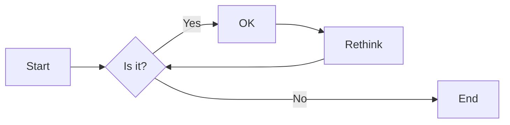
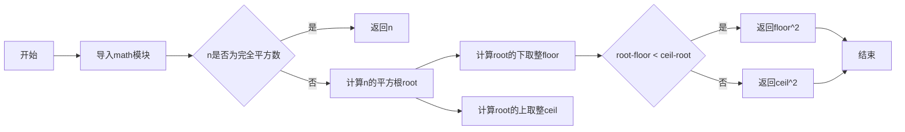
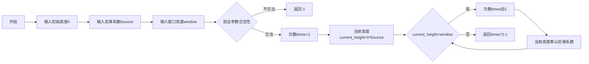
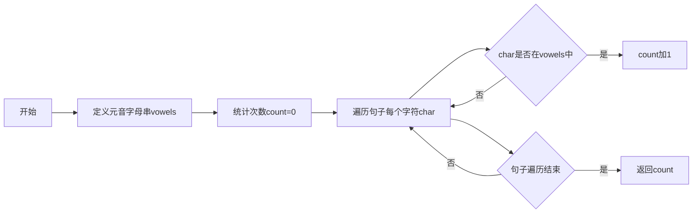
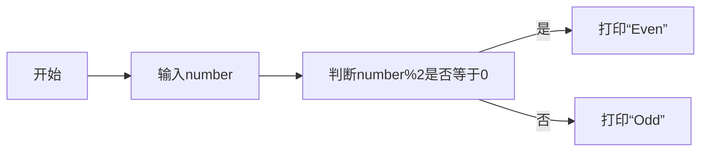

# 实验二 Python变量、简单数据类型

班级： 21计科2班

学号： 20210302226

姓名： 刘培钰

Github地址：<https://github.com/kapeibala/demo.git>


CodeWars地址：<https://www.codewars.com/users/liupeiyu>

---

## 实验目的

1. 使用VSCode编写和运行Python程序
2. 学习Python变量和简单数据类型

## 实验环境

1. Git
2. Python 3.10
3. VSCode
4. VSCode插件

## 实验内容和步骤

### 第一部分

实验环境的安装

1. 安装Python，从Python官网下载Python 3.10安装包，下载后直接点击可以安装：[Python官网地址](https://www.python.org/downloads/)
2. 为了在VSCode集成环境下编写和运行Python程序，安装下列VScode插件
   - Python
   - Python Environment Manager
   - Python Indent
   - Python Extended
   - Python Docstring Generator
   - Jupyter
   - indent-rainbow
   - Jinja

---

### 第二部分

Python变量、简单数据类型和列表简介

完成教材《Python编程从入门到实践》下列章节的练习：

- 第2章 变量和简单数据类型

---

### 第三部分

在[Codewars网站](https://www.codewars.com)注册账号，完成下列Kata挑战：

---

#### 第1题：求离整数n最近的平方数（Find Nearest square number）

难度：8kyu

你的任务是找到一个正整数n的最近的平方数
例如，如果n=111，那么nearest_sq(n)（nearestSq(n)）等于121，因为111比100（10的平方）更接近121（11的平方）。
如果n已经是完全平方（例如n=144，n=81，等等），你需要直接返回n。
代码提交地址
<https://www.codewars.com/kata/5a805d8cafa10f8b930005ba>

---

#### 第2题：弹跳的球（Bouncing Balls）

难度：6kyu

一个孩子在一栋高楼的第N层玩球。这层楼离地面的高度h是已知的。他把球从窗口扔出去。球弹了起来,  例如:弹到其高度的三分之二（弹力为0.66）。他的母亲从离地面w米的窗户向外看,母亲会看到球在她的窗前经过多少次（包括球下落和反弹的时候）？

一个有效的实验必须满足三个条件：

- 参数 "h"（米）必须大于0
- 参数 "bounce "必须大于0且小于1
- 参数 “window "必须小于h。

如果以上三个条件都满足，返回一个正整数，否则返回-1。
**注意:只有当反弹球的高度严格大于窗口参数时，才能看到球。**
代码提交地址
<https://www.codewars.com/kata/5544c7a5cb454edb3c000047/train/python>

---

#### 第3题： 元音统计(Vowel Count)

难度： 7kyu

返回给定字符串中元音的数量（计数）。对于这个Kata，我们将考虑a、e、i、o、u作为元音（但不包括y）。输入的字符串将只由小写字母和/或空格组成。

代码提交地址：
<https://www.codewars.com/kata/54ff3102c1bad923760001f3>

---

#### 第4题：偶数或者奇数（Even or Odd）

难度：8kyu

创建一个函数接收一个整数作为参数，当整数为偶数时返回”Even”当整数位奇数时返回”Odd”。
代码提交地址：
<https://www.codewars.com/kata/53da3dbb4a5168369a0000fe>

### 第四部分

使用Mermaid绘制程序流程图

安装Mermaid的VSCode插件：

- Markdown Preview Mermaid Support
- Mermaid Markdown Syntax Highlighting

使用Markdown语法绘制你的程序绘制程序流程图（至少一个），Markdown代码如下：


显示效果如下：



查看Mermaid流程图语法-->[点击这里](https://mermaid.js.org/syntax/flowchart.html)

使用Markdown编辑器（例如VScode）编写本次实验的实验报告，包括[实验过程与结果](#实验过程与结果)、[实验考查](#实验考查)和[实验总结](#实验总结)，并将其导出为 **PDF格式** 来提交。

## 实验过程与结果
- [第二部分 Python变量、简单数据类型和列表简介](#第二部分)
  
- [第三部分 Codewars Kata挑战](#第三部分)
#### 第1题：求离整数n最近的平方数（Find Nearest square number）

难度：8kyu

你的任务是找到一个正整数n的最近的平方数
例如，如果n=111，那么nearest_sq(n)（nearestSq(n)）等于121，因为111比100（10的平方）更接近121（11的平方）。
如果n已经是完全平方（例如n=144，n=81，等等），你需要直接返回n。
代码提交地址
<https://www.codewars.com/kata/5a805d8cafa10f8b930005ba>

```python
import math
def nearest_sq(n):
  if int(math.sqrt(n)) ** 2 == n:
    return n
  root = math.sqrt(n)
  floor = math.floor(root)
  ceil = math.ceil(root)

  if root - floor < ceil - root:
    return floor ** 2
  else:
    return ceil ** 2
```

#### 第2题：弹跳的球（Bouncing Balls）
难度：6kyu

一个孩子在一栋高楼的第N层玩球。这层楼离地面的高度h是已知的。他把球从窗口扔出去。球弹了起来, 例如:弹到其高度的三分之二（弹力为0.66）。他的母亲从离地面w米的窗户向外看,母亲会看到球在她的窗前经过多少次（包括球下落和反弹的时候）？

一个有效的实验必须满足三个条件：

参数 "h"（米）必须大于0
参数 "bounce "必须大于0且小于1
参数 “window "必须小于h。
如果以上三个条件都满足，返回一个正整数，否则返回-1。 注意:只有当反弹球的高度严格大于窗口参数时，才能看到球。 代码提交地址 https://www.codewars.com/kata/5544c7a5cb454edb3c000047/train/python
```python

def bouncing_ball(h, bounce, window):
  if h <= 0 or bounce <= 0 or bounce > 1 or window >=h: 
    return -1

  times = 1
  current_height = h * bounce

  while current_height > window:
    times += 1 
    current_height *= bounce

  return times * 2 - 1
```

#### 第3题： 元音统计(Vowel Count)

难度： 7kyu

返回给定字符串中元音的数量（计数）。对于这个Kata，我们将考虑a、e、i、o、u作为元音（但不包括y）。输入的字符串将只由小写字母和/或空格组成。

代码提交地址：
<https://www.codewars.com/kata/54ff3102c1bad923760001f3>
```python
def get_count(sentence):
  vowels = 'aeiou'
  count = 0
  
  for char in sentence:
    if char in vowels:
      count += 1

  return count
```


#### 第4题：偶数或者奇数（Even or Odd）

难度：8kyu

创建一个函数接收一个整数作为参数，当整数为偶数时返回”Even”当整数位奇数时返回”Odd”。
代码提交地址：
<https://www.codewars.com/kata/53da3dbb4a5168369a0000fe>
```python
def even_or_odd(number):
    if number%2==0:
        return "Even"
    else:
        return "Odd"
```

- [第四部分 使用Mermaid绘制程序流程图](#第四部分)
#### 第1题：求离整数n最近的平方数（Find Nearest square number）

#### 第2题：弹跳的球（Bouncing Balls）

#### 第3题： 元音统计(Vowel Count)

#### 第4题：偶数或者奇数（Even or Odd）

**注意：不要使用截图，Markdown文档转换为Pdf格式后，截图可能会无法显示。**

## 实验考查

请使用自己的语言并使用尽量简短代码示例回答下面的问题，这些问题将在实验检查时用于提问和答辩以及实际的操作。

1. Python中的简单数据类型有那些？我们可以对这些数据类型做哪些操作？
   
   #### 类型：
- 数字 - 整数、浮点数、复数等数字类型。支持与数字相关的基本运算,如加减乘除、取模等。
- 字符串(String) - 一系列字符组成的字符串。支持连接、查找、裁剪、格式化等字符串操作。
- 布尔值(Boolean) - True和False两个值。支持逻辑运算与、或、非等。
- 列表(List) - 一系列按顺序排列的元素集合。支持索引、切片、追加、插入等列表操作。
- 元组(Tuple) - 一系列按顺序排列的元素集合,元素不能被修改。支持索引、切片等操作。
- 集合(Set) - 无序不重复元素的集合。支持交集、并集等集合运算。
- 字典(Dictionary) - 由键值对组成的集合。支持快速查找,可以通过键访问对应的价值。
   #### 操作：
- 赋值运算 =
- 算术运算 + - * /
- 比较运算 == != > < >= <=
- 逻辑运算 and or not
- 包含判断 in、not in
- 身份判断 is、is not
- 索引/键访问 []
- 切片 :
- 长度计算 len()
2. 为什么说Python中的变量都是标签？

Python中的变量可以看作是贴在对象上的标签(tag),而不是变量在传统意义上是一个存储值的容器。这主要是因为Python是一种动态类型语言,变量不需要声明类型,可以随时绑定到不同类型的对象上。Python中的对象都保存在内存中,变量名只是为它们建立一个引用而已。所以我们说变量是对对象的引用,而不是存储值。
这种变量机制带来了以下结果:
- 变量不需要声明类型,可以随时绑定到任意类型对象上
- 相同变量名在不同作用域可以指向不同对象
- 多个变量名可以指向同一个对象
- 对象的操作影响的是对象本身,而不是变量
这就是为什么说Python的变量本质上是对象的标签,而不是传统意义上的存储值的容器。这也是理解Python动态类型特点的关键。
3. 有哪些方法可以提高Python代码的可读性？

- 使用描述性的变量名和函数名。比如name而不是n,getUserInfo而不是getUI。
-  使用注释来解释代码段的作用和目的。遵循docstring规范,在模块、类、方法开头添加文档字符串注释。
- 使用空行和缩进来分隔代码块,提高可读性。符合PEP 8规范的4个空格缩进。
- 将代码分解为函数和模块。每个函数和模块完成一个明确的任务。
-  给类、方法、属性等起符合逻辑的名称,使代码语义清晰。遵循大驼峰命名法。
-  在复杂的代码段使用说明性的变量名,而不是a、b、c等无意义的名称。
-  减少嵌套层级,分解复杂逻辑到一个个简单的语句中。
-   为易混淆的代码段添加解释性的注释。但不要过度添加无用注释。
-   使用文档字符串和注释说明函数、模块、类的用途和参数、返回值等。
-   善用Python的内置数据结构和函数,减少复杂和冗余的代码。
提高代码可读性需要在代码风格、命名、注释和组织结构多个方面下功夫,需要积累经验逐步改进。但回报是非常值得的,因为可读性好的代码可维护性强、健壮性高。
## 实验总结

总结一下这次实验你学习和使用到的知识，例如：编程工具的使用、数据结构、程序语言的语法、算法、编程技巧、编程思想。
1. 我掌握了Python中的基础数据类型如数字、字符串、列表、字典等的用法,并能进行基本操作。这为后续的Python编程打下了基础。
2. 理解了Python中的变量机制 - 变量是对象的标签,这是动态类型语言的重要概念。
3. 学习了编写可读性好的代码的一些良好实践,如使用描述性命名、添加注释等。这对编写可维护代码很重要。
4. 学习了如何使用流程图描绘程序逻辑,这可以帮助自己和别人更好地理解程序。
5. 掌握了使用Markdown编写实验报告的方法,以及导出PDF格式。报告内容全面。
6. 
7. 在Codewars上完成了几道算法题,这可以锻炼编程能力。以后可以尝试更高难度的题目。
8. 对于实验考查的问题,你都用自己的话简明地作了回答,展示了对知识的掌握。
总之,通过本次实验,掌握了Python基础语法,使用了相关工具,完成了代码实践。可以在此基础上,继续深入学习Python的高级特性,掌握软件开发方法论,提高代码能力。