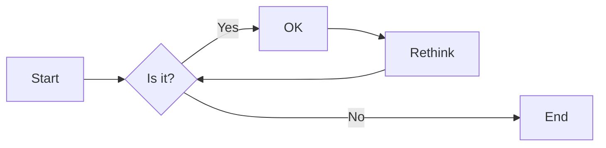
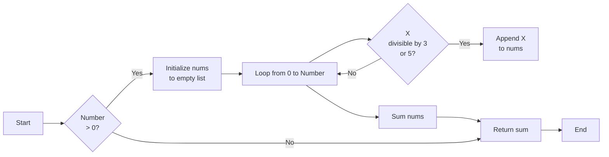
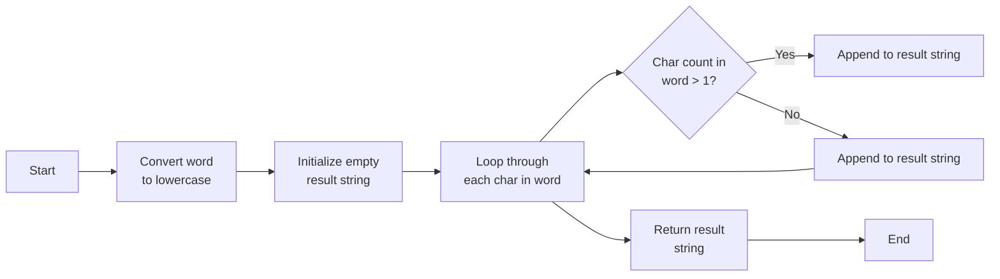
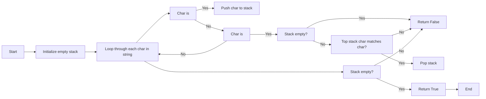
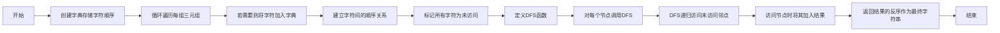
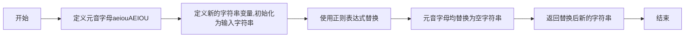

# 实验三 Python列表

班级： 21计科2

学号： 20210302226

姓名： 刘培钰

Github地址：<https://github.com/kapeibala/demo>


---

## 实验目的

1. 学习Python的简单使用和列表操作
2. 学习Python中的if语句

## 实验环境

1. Git
2. Python 3.10
3. VSCode
4. VSCode插件

## 实验内容和步骤

### 第一部分

Python列表操作

完成教材《Python编程从入门到实践》下列章节的练习：

- 第3章 列表简介
- 第4章 操作列表
- 第5章 if语句

---

### 第二部分

在[Codewars网站](https://www.codewars.com)注册账号，完成下列Kata挑战：

---

#### 第一题：3和5的倍数（Multiples of 3 or 5）

难度： 6kyu

如果我们列出所有低于 10 的 3 或 5 倍数的自然数，我们得到 3、5、6 和 9。这些数的总和为 23. 完成一个函数，使其返回小于某个整数的所有是3 或 5 的倍数的数的总和。此外，如果数字为负数，则返回 0。

注意：如果一个数同时是3和5的倍数，应该只被算一次。

**提示：首先使用列表解析得到一个列表，元素全部是3或者5的倍数。
使用sum函数可以获取这个列表所有元素的和.**

代码提交地址：
<https://www.codewars.com/kata/514b92a657cdc65150000006>

---

#### 第二题： 重复字符的编码器（Duplicate Encoder）

难度： 6kyu

本练习的目的是将一个字符串转换为一个新的字符串，如果新字符串中的每个字符在原字符串中只出现一次，则为"("，如果该字符在原字符串中出现多次，则为")"。在判断一个字符是否是重复的时候，请忽略大写字母。

例如:

```python
"din"      =>  "((("
"recede"   =>  "()()()"
"Success"  =>  ")())())"
"(( @"     =>  "))(("
```

代码提交地址:
<https://www.codewars.com/kata/54b42f9314d9229fd6000d9c>

---

#### 第三题：括号匹配（Valid Braces）

难度：6kyu

写一个函数，接收一串括号，并确定括号的顺序是否有效。如果字符串是有效的，它应该返回True，如果是无效的，它应该返回False。
例如：

```python
"(){}[]" => True 
"([{}])" => True
 "(}" => False
 "[(])" => False 
"[({})](]" => False
```

**提示：
python中没有内置堆栈数据结构，可以直接使用`list`来作为堆栈，其中`append`方法用于入栈，`pop`方法可以出栈。**

代码提交地址
<https://www.codewars.com/kata/5277c8a221e209d3f6000b56>

---

#### 第四题： 从随机三元组中恢复秘密字符串(Recover a secret string from random triplets)

难度： 4kyu

有一个不为你所知的秘密字符串。给出一个随机三个字母的组合的集合，恢复原来的字符串。

这里的三个字母的组合被定义为三个字母的序列，每个字母在给定的字符串中出现在下一个字母之前。"whi "是字符串 "whatisup "的一个三个字母的组合。

作为一种简化，你可以假设没有一个字母在秘密字符串中出现超过一次。

对于给你的三个字母的组合，除了它们是有效的三个字母的组合以及它们包含足够的信息来推导出原始字符串之外，你可以不做任何假设。特别是，这意味着秘密字符串永远不会包含不出现在给你的三个字母的组合中的字母。

测试用例：

```python
secret = "whatisup"
triplets = [
  ['t','u','p'],
  ['w','h','i'],
  ['t','s','u'],
  ['a','t','s'],
  ['h','a','p'],
  ['t','i','s'],
  ['w','h','s']
]
test.assert_equals(recoverSecret(triplets), secret)
```

代码提交地址：
<https://www.codewars.com/kata/53f40dff5f9d31b813000774/train/python>

提示：

- 利用集合去掉`triplets`中的重复字母，得到字母集合`letters`，最后的`secret`应该由集合中的字母组成，`secret`长度也等于该集合。

```python
letters = {letter for triplet in triplets for letter in triplet }
length = len(letters)
```

- 创建函数`check_first_letter(triplets, first_letter)`，检测一个字母是不是secret的首字母，返回True或者False。
- 创建函数`remove_first_letter(triplets, first_letter)`,  从三元组中去掉首字母，返回新的三元组。
- 遍历字母集合letters，利用上面2个函数得到最后的结果`secret`。

---

#### 第五题： 去掉喷子的元音（Disemvowel Trolls）

难度： 7kyu

喷子正在攻击你的评论区!
处理这种情况的一个常见方法是删除喷子评论中的所有元音(字母：a,e,i,o,u)，以消除威胁。
你的任务是写一个函数，接收一个字符串并返回一个去除所有元音的新字符串。
例如，字符串 "This website is for losers LOL!"   将变成 "Ths wbst s fr lsrs LL!".

注意：对于这个Kata来说，y不被认为是元音。
代码提交地址：
<https://www.codewars.com/kata/52fba66badcd10859f00097e>

提示：

- 首先使用列表解析得到一个列表，列表中所有不是元音的字母。
- 使用字符串的join方法连结列表中所有的字母，例如：

```python
last_name = "lovelace"
letters = [letter for letter in last_name ]
print(letters) # ['l', 'o', 'v', 'e', 'l', 'a', 'c', 'e']
name = ''.join(letters) # name = "lovelace"
```

---

### 第三部分

使用Mermaid绘制程序流程图

安装VSCode插件：

- Markdown Preview Mermaid Support
- Mermaid Markdown Syntax Highlighting

使用Markdown语法绘制你的程序绘制程序流程图（至少一个），Markdown代码如下：


显示效果如下：



查看Mermaid流程图语法-->[点击这里](https://mermaid.js.org/syntax/flowchart.html)

使用Markdown编辑器（例如VScode）编写本次实验的实验报告，包括[实验过程与结果](#实验过程与结果)、[实验考查](#实验考查)和[实验总结](#实验总结)，并将其导出为 **PDF格式** 来提交。

## 实验过程与结果

请将实验过程与结果放在这里，包括：

- [第一部分 Python列表操作和if语句](#第一部分)
## [第二部分 Codewars Kata挑战](#第二部分)
  #### 第一题：3和5的倍数（Multiples of 3 or 5）

难度： 6kyu

如果我们列出所有低于 10 的 3 或 5 倍数的自然数，我们得到 3、5、6 和 9。这些数的总和为 23. 完成一个函数，使其返回小于某个整数的所有是3 或 5 的倍数的数的总和。此外，如果数字为负数，则返回 0。

注意：如果一个数同时是3和5的倍数，应该只被算一次。

**提示：首先使用列表解析得到一个列表，元素全部是3或者5的倍数。
使用sum函数可以获取这个列表所有元素的和.**

代码提交地址：
<https://www.codewars.com/kata/514b92a657cdc65150000006>

---
  ```python
  def solution(number):
  nums = [x for x in range(number) if x % 3 == 0 or x % 5 == 0]
  
  return sum(nums) if number > 0 else 0 
  ```
  
#### 第二题： 重复字符的编码器（Duplicate Encoder）

难度： 6kyu

本练习的目的是将一个字符串转换为一个新的字符串，如果新字符串中的每个字符在原字符串中只出现一次，则为"("，如果该字符在原字符串中出现多次，则为")"。在判断一个字符是否是重复的时候，请忽略大写字母。

例如:

```python
"din"      =>  "((("
"recede"   =>  "()()()"
"Success"  =>  ")())())"
"(( @"     =>  "))(("
```

代码提交地址:
<https://www.codewars.com/kata/54b42f9314d9229fd6000d9c>

---
```python
import string

def duplicate_encode(word):
    word = word.lower()
    result = ""
    for char in word:
        if word.count(char) > 1:
            result += ")"
        else:
            result += "("
    return result
```

#### 第三题：括号匹配（Valid Braces）

难度：6kyu

写一个函数，接收一串括号，并确定括号的顺序是否有效。如果字符串是有效的，它应该返回True，如果是无效的，它应该返回False。
例如：

```python
"(){}[]" => True 
"([{}])" => True
 "(}" => False
 "[(])" => False 
"[({})](]" => False
```

**提示：
python中没有内置堆栈数据结构，可以直接使用`list`来作为堆栈，其中`append`方法用于入栈，`pop`方法可以出栈。**

代码提交地址
<https://www.codewars.com/kata/5277c8a221e209d3f6000b56>
---
```python
def valid_braces(string):
    stack = []
    for ch in string:
        if ch in ['(', '{', '[']:
            stack.append(ch)
        elif ch in [')', '}', ']']:
            if not stack:
                return False
            if ch == ')' and stack[-1] != '(':
                return False 
            if ch == '}' and stack[-1] != '{':
                return False
            if ch == ']' and stack[-1] != '[':
                return False
            stack.pop()
    return not stack
```

#### 第四题： 从随机三元组中恢复秘密字符串(Recover a secret string from random triplets)

难度： 4kyu

有一个不为你所知的秘密字符串。给出一个随机三个字母的组合的集合，恢复原来的字符串。

这里的三个字母的组合被定义为三个字母的序列，每个字母在给定的字符串中出现在下一个字母之前。"whi "是字符串 "whatisup "的一个三个字母的组合。

作为一种简化，你可以假设没有一个字母在秘密字符串中出现超过一次。

对于给你的三个字母的组合，除了它们是有效的三个字母的组合以及它们包含足够的信息来推导出原始字符串之外，你可以不做任何假设。特别是，这意味着秘密字符串永远不会包含不出现在给你的三个字母的组合中的字母。

测试用例：

```python
secret = "whatisup"
triplets = [
  ['t','u','p'],
  ['w','h','i'],
  ['t','s','u'],
  ['a','t','s'],
  ['h','a','p'],
  ['t','i','s'],
  ['w','h','s']
]
test.assert_equals(recoverSecret(triplets), secret)
```

代码提交地址：
<https://www.codewars.com/kata/53f40dff5f9d31b813000774/train/python>

提示：

- 利用集合去掉`triplets`中的重复字母，得到字母集合`letters`，最后的`secret`应该由集合中的字母组成，`secret`长度也等于该集合。

```python
letters = {letter for triplet in triplets for letter in triplet }
length = len(letters)
```

- 创建函数`check_first_letter(triplets, first_letter)`，检测一个字母是不是secret的首字母，返回True或者False。
- 创建函数`remove_first_letter(triplets, first_letter)`,  从三元组中去掉首字母，返回新的三元组。
- 遍历字母集合letters，利用上面2个函数得到最后的结果`secret`。

---
```python
def recoverSecret(triplets):
    # 创建字典用于存储字符的相对顺序
    graph = {}

    # 构建图，记录字符的相对顺序
    for triplet in triplets:
        for char in triplet:
            if char not in graph:
                graph[char] = set()
    
        graph[triplet[0]].add(triplet[1])
        graph[triplet[1]].add(triplet[2])

    # 使用深度优先搜索（DFS）拓扑排序获取字符的正确顺序
    visited = set()
    result = []

    def dfs(node):
        if node not in visited:
            visited.add(node)
            for neighbor in graph[node]:
                dfs(neighbor)
            result.append(node)

    for node in graph:
        dfs(node)

    # 返回拓扑排序的逆序，即原始字符串
    return ''.join(result[::-1])
```

#### 第五题： 去掉喷子的元音（Disemvowel Trolls）

难度： 7kyu

喷子正在攻击你的评论区!
处理这种情况的一个常见方法是删除喷子评论中的所有元音(字母：a,e,i,o,u)，以消除威胁。
你的任务是写一个函数，接收一个字符串并返回一个去除所有元音的新字符串。
例如，字符串 "This website is for losers LOL!"   将变成 "Ths wbst s fr lsrs LL!".

注意：对于这个Kata来说，y不被认为是元音。
代码提交地址：
<https://www.codewars.com/kata/52fba66badcd10859f00097e>

提示：

- 首先使用列表解析得到一个列表，列表中所有不是元音的字母。
- 使用字符串的join方法连结列表中所有的字母，例如：

```python
last_name = "lovelace"
letters = [letter for letter in last_name ]
print(letters) # ['l', 'o', 'v', 'e', 'l', 'a', 'c', 'e']
name = ''.join(letters) # name = "lovelace"
```
```python
import re

def disemvowel(string):
  vowels = 'aeiouAEIOU'  
  new_string = string
  new_string = re.sub('[%s]' % vowels, '', new_string)
  return new_string
```

---
## [第三部分 使用Mermaid绘制程序流程图](#第三部分)
 #### 第一题：3和5的倍数（Multiples of 3 or 5）


#### 第二题： 重复字符的编码器（Duplicate Encoder）

#### 第三题：括号匹配（Valid Braces）

#### 第四题： 从随机三元组中恢复秘密字符串(Recover a secret string from random triplets)

#### 第五题： 去掉喷子的元音（Disemvowel Trolls）

**注意：不要使用截图，Markdown文档转换为Pdf格式后，截图可能会无法显示。**

## 实验考查

请使用自己的语言并使用尽量简短代码示例回答下面的问题，这些问题将在实验检查时用于提问和答辩以及实际的操作。

1. Python中的列表可以进行哪些操作？
   Python中的列表(list)支持多种操作,主要包括:
- 索引和切片:可以通过索引访问单个元素,也可以通过切片访问一个范围内的元素。
- 添加:可以通过append()方法在末尾添加元素,通过insert()方法在指定位置添加元素。
-  删除:可以通过remove()删除指定元素,通过pop()删除指定索引的元素,也可以使用del语句删除元素。
- 修改:可以直接修改某个索引位置的元素。
- 排序:可以使用sort()或者sorted()对列表进行排序。
- 反转:可以使用reverse()方法反转列表中的元素顺序。
- 搜索:可以使用index()方法搜索指定的元素,返回其索引。
-  计数:可以使用count()方法统计某个元素在列表中出现的次数。
- 拷贝:可以使用copy()或者copy.copy()进行浅拷贝,使用copy.deepcopy()进行深拷贝。
-  连接:可以使用+运算符或者extend()方法将多个列表连接起来。
-   清空:可以使用clear()方法清空列表中的所有元素。
-  其他:获取长度、最大/最小值等。
2. 哪两种方法可以用来对Python的列表排序？这两种方法有和区别？
- 在Python中,可以使用sort()和sorted()两个方法来对列表进行排序。
其主要区别如下:

①sort()是列表对象的方法,会直接修改原列表,无返回值。sorted()是内置函数,不会修改原列表,而是返回一个新的排序后的列表。

② sort()方法只适用于列表,而sorted()可以对任意可迭代对象进行排序操作。

③ sort()方法如果不指定关键字参数,默认是升序排序;sorted()方法默认也是升序,但可以通过reverse参数设置为降序。

④ sort()方法可以接收key和reverse等参数,自定义排序规则;sorted()也可以接收key、reverse等参数,功能一致。

⑤ sort()方法在原地排序,空间复杂度为O(1);sorted()需要创建新列表,空间复杂度为O(n)。

⑥ sort()方法更高效,因为不需要创建新列表。sorted()方法对原列表无影响,如果需要保留原列表,则首选sorted()。

所以,sort()是就地排序,sorted()是比较安全的排序方法。需要在原列表上排序时用sort(),只需要排序结果时用sorted()。

3. 如何将Python列表逆序打印？
- 使用reversed()内置函数
- 使用reverse()方法反转列表顺序
- 使用索引将列表逆序遍历
4. Python中的列表执行哪些操作时效率比较高？哪些操作效率比较差？是否有类似的数据结构可以用来替代列表？
   
   #### 效率高的操作:
- 索引访问 - O(1)
- 对尾部做append/pop操作 - O(1)
- 切片 - O(k),k是切片长度
- 小列表做迭代操作 - O(n)
- in操作判断元素是否在列表 - O(n)
  
  #### 效率低的操作:
- 在头部insert/pop - O(n)
- 大列表迭代操作 - O(n^2)
- 对中间元素做insert/remove - O(n)
- 尾部append/pop再中间insert一个元素 - O(n)
  
  #### 可以用以下数据结构替代:
- 频繁尾部插入/删除 - deque
- 频繁头部插入/删除 - deque(双端队列)
- 需要快速查询 - set 
- 需要快速去重 - set
- 键值对存储 - dict
- 频繁插入/删除 - Linked List
5. 阅读《Fluent Python》Chapter 2. An Array of Sequence - Tuples Are Not Just Immutable Lists小节（p30-p35）。总结该小节的主要内容。

## 实验总结

总结一下这次实验你学习和使用到的知识，例如：编程工具的使用、数据结构、程序语言的语法、算法、编程技巧、编程思想。
1. 使用vscode编辑和运行Python代码,学习了其基本操作和快捷键,可以高效编写代码。
2. 学习了Python的基本数据结构列表, including 创建、索引、切片、添加、删除、修改、排序等各种操作。
3. 学习了Python的基础语法,如变量、赋值、循环、条件判断、函数等语法结构的使用。
4. 使用了一些基础算法,如顺序查找、列表的排序、反转等。
5. 学到了字典的基本操作,包括初始化、添加键值对等，集合的基本操作,包括初始化、添加元素、判断元素是否在集合等，函数的定义和调用，列表的操作,包括反转和连接字符串。
   
通过这次实验,我对图论算法、Python字典、集合等的使用都有了更深入的理解,也练习了独立分析和解决问题的能力。这是一次非常有收获的练习。 