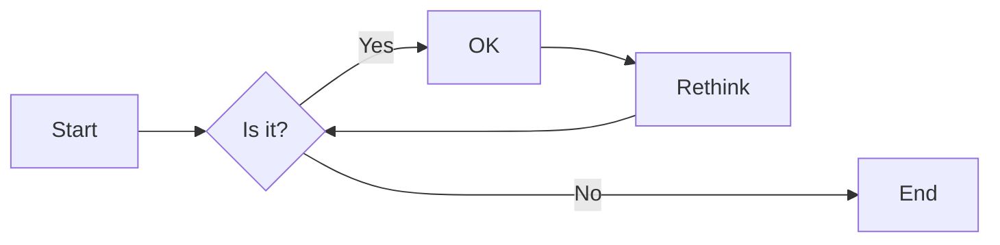
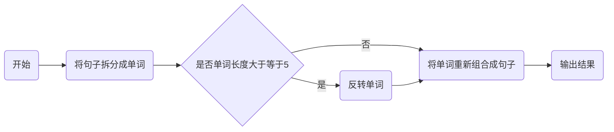
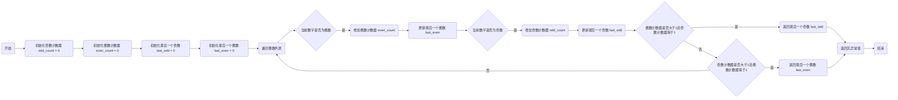
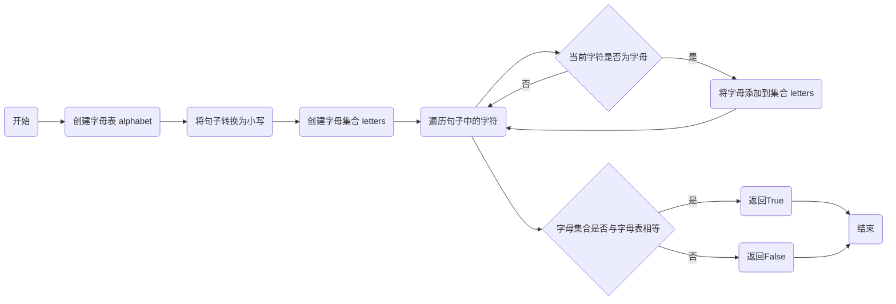
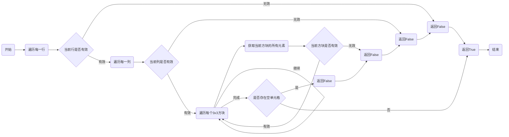
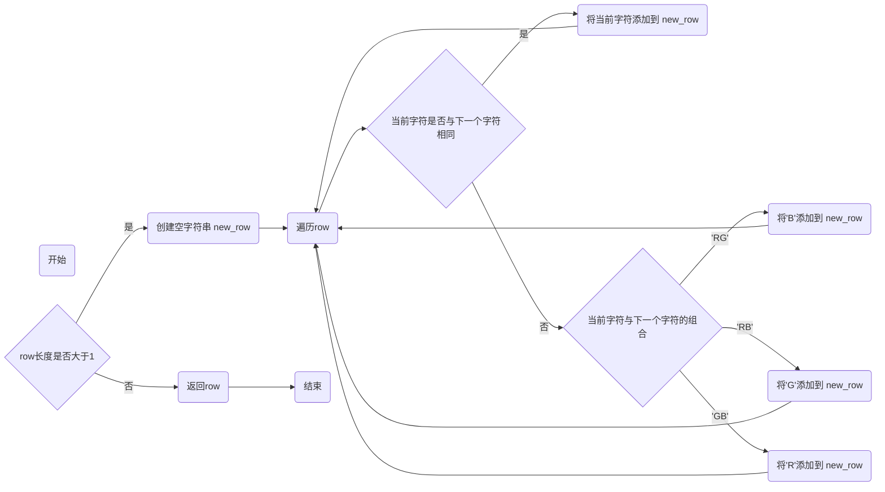

# 实验五 Python数据结构与数据模型

班级： 21计科2

学号： 20210302226

姓名： 刘培钰

Github地址：<https://github.com/kapeibala/python>

CodeWars地址：<https://www.codewars.com/users/yourusername>

---

## 实验目的

1. 学习Python数据结构的高级用法
2. 学习Python的数据模型

## 实验环境

1. Git
2. Python 3.10
3. VSCode
4. VSCode插件

## 实验内容和步骤

### 第一部分

在[Codewars网站](https://www.codewars.com)注册账号，完成下列Kata挑战：

---

#### 第一题：停止逆转我的单词

难度： 6kyu

编写一个函数，接收一个或多个单词的字符串，并返回相同的字符串，但所有5个或更多的字母单词都是相反的（就像这个Kata的名字一样）。传入的字符串将只由字母和空格组成。只有当出现一个以上的单词时，才会包括空格。
例如：

```python
spinWords( "Hey fellow warriors" ) => returns "Hey wollef sroirraw" 
spinWords( "This is a test") => returns "This is a test" 
spinWords( "This is another test" )=> returns "This is rehtona test"
```

代码提交地址：
<https://www.codewars.com/kata/5264d2b162488dc400000001>

提示：

- 利用str的split方法可以将字符串分为单词列表
例如：

```python
words = "hey fellow warrior".split()
# words should be ['hey', 'fellow', 'warrior']
```

- 利用列表推导将长度大于等于5的单词反转(利用切片word[::-1])
- 最后使用str的join方法连结列表中的单词。

---

#### 第二题： 发现离群的数(Find The Parity Outlier)

难度：6kyu

给你一个包含整数的数组（其长度至少为3，但可能非常大）。该数组要么完全由奇数组成，要么完全由偶数组成，除了一个整数N。请写一个方法，以该数组为参数，返回这个 "离群 "的N。

例如：

```python
[2, 4, 0, 100, 4, 11, 2602, 36]
# Should return: 11 (the only odd number)

[160, 3, 1719, 19, 11, 13, -21]
# Should return: 160 (the only even number)
```

代码提交地址：
<https://www.codewars.com/kata/5526fc09a1bbd946250002dc>

---

#### 第三题： 检测Pangram

难度：6kyu

pangram是一个至少包含每个字母一次的句子。例如，"The quick brown fox jumps over the lazy dog "这个句子就是一个pangram，因为它至少使用了一次字母A-Z（大小写不相关）。

给定一个字符串，检测它是否是一个pangram。如果是则返回`True`，如果不是则返回`False`。忽略数字和标点符号。
代码提交地址：
<https://www.codewars.com/kata/545cedaa9943f7fe7b000048>

---

#### 第四题： 数独解决方案验证

难度：6kyu

数独背景

数独是一种在 9x9 网格上进行的游戏。游戏的目标是用 1 到 9 的数字填充网格的所有单元格，以便每一列、每一行和九个 3x3 子网格（也称为块）中的都包含数字 1 到 9。更多信息请访问：<http://en.wikipedia.org/wiki/Sudoku>

编写一个函数接受一个代表数独板的二维数组，如果它是一个有效的解决方案则返回 true，否则返回 false。数独板的单元格也可能包含 0，这将代表空单元格。包含一个或多个零的棋盘被认为是无效的解决方案。棋盘总是 9 x 9 格，每个格只包含 0 到 9 之间的整数。

代码提交地址：
<https://www.codewars.com/kata/63d1bac72de941033dbf87ae>

---

#### 第五题： 疯狂的彩色三角形

难度： 2kyu

一个彩色的三角形是由一排颜色组成的，每一排都是红色、绿色或蓝色。连续的几行，每一行都比上一行少一种颜色，是通过考虑前一行中的两个相接触的颜色而产生的。如果这些颜色是相同的，那么新的一行就使用相同的颜色。如果它们不同，则在新的一行中使用缺失的颜色。这个过程一直持续到最后一行，只有一种颜色被生成。

例如：
```python
Colour here:            G G        B G        R G        B R
Becomes colour here:     G          R          B          G
```


一个更大的三角形例子：

```python
R R G B R G B B
 R B R G B R B
  G G B R G G
   G R G B G
    B B R R
     B G R
      R B
       G
```

你将得到三角形的第一行字符串，你的工作是返回最后的颜色，这将出现在最下面一行的字符串。在上面的例子中，你将得到 "RRGBRGBB"，你应该返回 "G"。
限制条件： 1 <= length(row) <= 10 ** 5
输入的字符串将只包含大写字母'B'、'G'或'R'。

例如：

```python
triangle('B') == 'B'
triangle('GB') == 'R'
triangle('RRR') == 'R'
triangle('RGBG') == 'B'
triangle('RBRGBRB') == 'G'
triangle('RBRGBRBGGRRRBGBBBGG') == 'G'
```

代码提交地址：
<https://www.codewars.com/kata/5a331ea7ee1aae8f24000175>

提示：请参考下面的链接，利用三进制的特点来进行计算。
<https://stackoverflow.com/questions/53585022/three-colors-triangles>

---

### 第二部分

使用Mermaid绘制程序流程图

安装VSCode插件：

- Markdown Preview Mermaid Support
- Mermaid Markdown Syntax Highlighting

使用Markdown语法绘制你的程序绘制程序流程图（至少一个），Markdown代码如下：


显示效果如下：



查看Mermaid流程图语法-->[点击这里](https://mermaid.js.org/syntax/flowchart.html)

使用Markdown编辑器（例如VScode）编写本次实验的实验报告，包括[实验过程与结果](#实验过程与结果)、[实验考查](#实验考查)和[实验总结](#实验总结)，并将其导出为 **PDF格式** 来提交。

## 实验过程与结果

请将实验过程与结果放在这里，包括：

- [第一部分 Codewars Kata挑战](#第一部分)
  #### 第一题：停止逆转我的单词

难度： 6kyu

编写一个函数，接收一个或多个单词的字符串，并返回相同的字符串，但所有5个或更多的字母单词都是相反的（就像这个Kata的名字一样）。传入的字符串将只由字母和空格组成。只有当出现一个以上的单词时，才会包括空格。
例如：

```python
spinWords( "Hey fellow warriors" ) => returns "Hey wollef sroirraw" 
spinWords( "This is a test") => returns "This is a test" 
spinWords( "This is another test" )=> returns "This is rehtona test"
```

代码提交地址：
<https://www.codewars.com/kata/5264d2b162488dc400000001>

提示：

- 利用str的split方法可以将字符串分为单词列表
例如：

```python
words = "hey fellow warrior".split()
# words should be ['hey', 'fellow', 'warrior']
```

- 利用列表推导将长度大于等于5的单词反转(利用切片word[::-1])
- 最后使用str的join方法连结列表中的单词。
```python
def spin_words(sentence):
    words = sentence.split()  # Split the sentence into a list of words
    for i in range(len(words)):
        if len(words[i]) >= 5:
            words[i] = words[i][::-1]  # Reverse the word if it has five or more letters
    return ' '.join(words)  # Join the words back into a sentence


```

---

#### 第二题： 发现离群的数(Find The Parity Outlier)

难度：6kyu

给你一个包含整数的数组（其长度至少为3，但可能非常大）。该数组要么完全由奇数组成，要么完全由偶数组成，除了一个整数N。请写一个方法，以该数组为参数，返回这个 "离群 "的N。

例如：

```python
[2, 4, 0, 100, 4, 11, 2602, 36]
# Should return: 11 (the only odd number)

[160, 3, 1719, 19, 11, 13, -21]
# Should return: 160 (the only even number)
```

代码提交地址：
<https://www.codewars.com/kata/5526fc09a1bbd946250002dc>
```python
def find_outlier(integers):
    odd_count = 0
    even_count = 0
    last_odd = 0
    last_even = 0

    for num in integers:
        if num % 2 == 0:  # Even number
            even_count += 1
            last_even = num
        else:  # Odd number
            odd_count += 1
            last_odd = num

        if even_count > 1 and odd_count == 1:
            return last_odd
        elif odd_count > 1 and even_count == 1:
            return last_even

    return None  # No outlier found


```

---

#### 第三题： 检测Pangram

难度：6kyu

pangram是一个至少包含每个字母一次的句子。例如，"The quick brown fox jumps over the lazy dog "这个句子就是一个pangram，因为它至少使用了一次字母A-Z（大小写不相关）。

给定一个字符串，检测它是否是一个pangram。如果是则返回`True`，如果不是则返回`False`。忽略数字和标点符号。
代码提交地址：
<https://www.codewars.com/kata/545cedaa9943f7fe7b000048>
```python
import string

def is_pangram(sentence):
    alphabet = set(string.ascii_lowercase)  # Set of all lowercase letters
    sentence = sentence.lower()  # Convert the sentence to lowercase
    letters = set(char for char in sentence if char.isalpha())  # Set of unique letters in the sentence
    return letters == alphabet  # Check if the sets are equal


```

---

#### 第四题： 数独解决方案验证

难度：6kyu

数独背景

数独是一种在 9x9 网格上进行的游戏。游戏的目标是用 1 到 9 的数字填充网格的所有单元格，以便每一列、每一行和九个 3x3 子网格（也称为块）中的都包含数字 1 到 9。更多信息请访问：<http://en.wikipedia.org/wiki/Sudoku>

编写一个函数接受一个代表数独板的二维数组，如果它是一个有效的解决方案则返回 true，否则返回 false。数独板的单元格也可能包含 0，这将代表空单元格。包含一个或多个零的棋盘被认为是无效的解决方案。棋盘总是 9 x 9 格，每个格只包含 0 到 9 之间的整数。

代码提交地址：
<https://www.codewars.com/kata/63d1bac72de941033dbf87ae>
```python
def validate_sudoku(board):
    for i in range(9):  
        if sorted(board[i]) != list(range(1, 10)):  
            return False
    for j in range(9):  
        if sorted([cell[j] for cell in board]) != list(range(1, 10)):  
            return False
    for block_row in range(0, 9, 3):  
        for block_col in range(0, 9, 3):  
            block = [board[x][y] for x in range(block_row, block_row + 3) for y in range(block_col, block_col + 3)]  
            if sorted(block) != list(range(1, 10)):  
                return False
    if any(cell == 0 for row in board for cell in row):  
        return False  
    return True
```

---

#### 第五题： 疯狂的彩色三角形

难度： 2kyu

一个彩色的三角形是由一排颜色组成的，每一排都是红色、绿色或蓝色。连续的几行，每一行都比上一行少一种颜色，是通过考虑前一行中的两个相接触的颜色而产生的。如果这些颜色是相同的，那么新的一行就使用相同的颜色。如果它们不同，则在新的一行中使用缺失的颜色。这个过程一直持续到最后一行，只有一种颜色被生成。

例如：
```python
Colour here:            G G        B G        R G        B R
Becomes colour here:     G          R          B          G
```


一个更大的三角形例子：

```python
R R G B R G B B
 R B R G B R B
  G G B R G G
   G R G B G
    B B R R
     B G R
      R B
       G
```

你将得到三角形的第一行字符串，你的工作是返回最后的颜色，这将出现在最下面一行的字符串。在上面的例子中，你将得到 "RRGBRGBB"，你应该返回 "G"。
限制条件： 1 <= length(row) <= 10 ** 5
输入的字符串将只包含大写字母'B'、'G'或'R'。

例如：

```python
triangle('B') == 'B'
triangle('GB') == 'R'
triangle('RRR') == 'R'
triangle('RGBG') == 'B'
triangle('RBRGBRB') == 'G'
triangle('RBRGBRBGGRRRBGBBBGG') == 'G'
```

代码提交地址：
<https://www.codewars.com/kata/5a331ea7ee1aae8f24000175>

提示：请参考下面的链接，利用三进制的特点来进行计算。
<https://stackoverflow.com/questions/53585022/three-colors-triangles>
```python
def triangle(row):
    while len(row) > 1:
        new_row = ""
        for i in range(len(row) - 1):
            if row[i] == row[i+1]:
                new_row += row[i]
            else:
                if row[i] == 'R' and row[i+1] == 'G' or row[i] == 'G' and row[i+1] == 'R':
                    new_row += 'B'
                elif row[i] == 'R' and row[i+1] == 'B' or row[i] == 'B' and row[i+1] == 'R':
                    new_row += 'G'
                elif row[i] == 'G' and row[i+1] == 'B' or row[i] == 'B' and row[i+1] == 'G':
                    new_row += 'R'
        row = new_row
    return row

```

- [第二部分 使用Mermaid绘制程序流程图](#第二部分)

注意代码需要使用markdown的代码块格式化，例如Git命令行语句应该使用下面的格式：
#### 第一题：停止逆转我的单词

#### 第二题： 发现离群的数(Find The Parity Outlier)

#### 第三题： 检测Pangram

#### 第四题： 数独解决方案验证

#### 第五题： 疯狂的彩色三角形

**注意：不要使用截图，因为Markdown文档转换为Pdf格式后，截图会无法显示。**

## 实验考查

请使用自己的语言并使用尽量简短代码示例回答下面的问题，这些问题将在实验检查时用于提问和答辩以及实际的操作。

1. 集合（set）类型有什么特点？它和列表（list）类型有什么区别？
- 集合（set）类型是Python中的一种数据类型，它是由唯一且不可变的元素组成的无序集合。集合中的元素不能重复，且没有固定的顺序。集合是可变的，可以添加、删除和修改元素。

- 列表（list）类型也是Python中的一种数据类型，它是由有序且可重复的元素组成的序列。列表中的元素可以重复，且有固定的顺序。列表是可变的，可以添加、删除和修改元素。

```
主要区别如下：
唯一性：集合中的元素是唯一的，不允许重复，而列表中的元素可以重复。
顺序性：集合是无序的，元素没有固定的顺序，而列表是有序的，元素按照插入的顺序排列。
可变性：集合是可变的，可以通过添加、删除和修改元素来改变集合的内容，而列表也是可变的。
存储方式：集合使用哈希表实现，而列表使用数组实现。
在使用时，根据需求选择合适的数据类型。如果需要存储唯一且不可重复的元素，并且对元素的顺序不敏感，可以使用集合。如果需要有序的、可重复的元素，并且对元素的顺序敏感，可以使用列表
```
2. 集合（set）类型主要有那些操作？

- 创建集合：可以使用花括号{}或set()函数来创建一个空集合，或者使用一组元素初始化一个集合。

- 添加元素：可以使用add()方法向集合中添加一个元素，如果元素已经存在，则不会重复添加。

- 移除元素：可以使用remove()方法从集合中移除指定的元素，如果元素不存在，则会引发KeyError错误。另外，还可以使用discard()方法来移除元素，如果元素不存在，则不会引发错误。

- 清空集合：可以使用clear()方法来清空集合中的所有元素。

- 判断元素是否存在：可以使用in关键字来判断一个元素是否存在于集合中。

- 集合运算：集合类型支持一系列的集合运算，包括并集、交集、差集和对称差等。
```
并集：可以使用union()方法或者|运算符来获取两个集合的并集。
交集：可以使用intersection()方法或者&运算符来获取两个集合的交集。
差集：可以使用difference()方法或者-运算符来获取两个集合的差集，即从第一个集合中移除第二个集合中的元素。
对称差：可以使用symmetric_difference()方法或者^运算符来获取两个集合的对称差集，即获取两个集合中不重复的元素。
```
- 集合大小：可以使用len()函数来获取集合中元素的个数。
- 遍历集合：可以使用for循环来遍历集合中的所有元素。
3. 使用`*`操作符作用到列表上会产生什么效果？为什么不能使用`*`操作符作用到嵌套的列表上？使用简单的代码示例说明。
- 使用*操作符作用到列表上会将列表中的元素重复指定的次数。例如，[1, 2, 3] * 2会产生一个新的列表[1, 2, 3, 1, 2, 3]，其中原列表中的元素重复了两次。

- 然而，不能使用*操作符直接作用到嵌套的列表上，因为*操作符只是简单地将列表中的元素复制指定的次数，对于嵌套的列表，只是复制了嵌套列表的引用，而不是复制嵌套列表本身。这意味着当修改其中一个嵌套列表时，其他嵌套列表也会被修改，这通常不是我们想要的结果。

以下是一个简单的代码示例来说明这个问题：
```
nested_list = [[1, 2, 3]] * 3
nested_list[0][0] = 0
print(nested_list)
输出结果为：

[[0, 2, 3], [0, 2, 3], [0, 2, 3]]
可以看到，修改了nested_list[0][0]的值为0，但是其他的嵌套列表也被修改了。这是因为[1, 2, 3] * 3实际上只是复制了嵌套列表的引用，所以当修改其中一个嵌套列表时，其他嵌套列表也会受到影响。

如果想要复制嵌套列表本身，可以使用循环或列表推导式来创建新的嵌套列表。例如：

nested_list = [[1, 2, 3] for _ in range(3)]
nested_list[0][0] = 0
print(nested_list)
输出结果为：

[[0, 2, 3], [1, 2, 3], [1, 2, 3]]
```
- 可以看到，只有第一个嵌套列表被修改，其他的嵌套列表保持不变。这是因为通过列表推导式创建了新的嵌套列表，每个嵌套列表都是独立的，修改其中一个不会影响其他的嵌套列表。


4. 总结列表,集合，字典的解析（comprehension）的使用方法。使用简单的代码示例说明。
- 列表、集合和字典解析（comprehension）是一种简洁而强大的语法，用于根据现有的可迭代对象创建新的列表、集合或字典。它们提供了一种快速创建和转换数据结构的方法。

- 列表解析（List Comprehension）：
```
语法：[expression for item in iterable if condition]

示例：

numbers = [1, 2, 3, 4, 5]
squares = [x**2 for x in numbers]
print(squares)  # 输出: [1, 4, 9, 16, 25]\
```
- 集合解析（Set Comprehension）：
```
语法：{expression for item in iterable if condition}

示例：

numbers = [1, 2, 3, 4, 5]
squares = {x**2 for x in numbers}
print(squares)  # 输出: {1, 4, 9, 16, 25}
```
字典解析（Dictionary Comprehension）：
```
语法：{key_expression: value_expression for item in iterable if condition}

示例：

numbers = [1, 2, 3, 4, 5]
squares = {x: x**2 for x in numbers}
print(squares)  # 输出: {1: 1, 2: 4, 3: 9, 4: 16, 5: 25}
```
在上述示例中，我们使用解析来根据现有的可迭代对象（numbers）创建新的列表（squares）、集合（squares）和字典（squares）。通过指定表达式（x**2）和迭代的变量（x），我们可以对每个元素进行操作，并使用可选的条件来过滤元素。
## 实验总结

总结一下这次实验你学习和使用到的知识，例如：编程工具的使用、数据结构、程序语言的语法、算法、编程技巧、编程思想。
Python数据结构的高级用法：

- 列表（List）：
使用切片（Slice）操作来获取子列表或指定范围的元素。
使用列表解析（List Comprehension）来快速创建、转换和筛选列表。
使用内置函数（如map()、filter()、reduce()）来对列表进行函数式编程操作。
使用zip()函数将多个列表合并为一个元组列表。
元组（Tuple）：
元组是不可变的，可以用作字典的键或集合的元素。
可以使用元组解析（Tuple Unpacking）将元组的值分配给多个变量。
- 集合（Set）：
使用集合解析（Set Comprehension）来快速创建和筛选集合。
使用集合操作（如并集、交集、差集）来对集合进行常用操作。
- 字典（Dictionary）：
使用字典解析（Dictionary Comprehension）来快速创建和转换字典。
使用keys()、values()、items()等方法来访问字典的键、值和键值对。
使用get()方法来安全地获取字典中的值，避免出现KeyError异常。
- 字符串（String）：
字符串是不可变的，可以使用切片和字符串方法来处理和操作字符串。
使用字符串格式化（String Formatting）来动态构建字符串。
使用正则表达式（Regular Expression）来进行字符串匹配和替换操作。
- 学习Python的数据模型：
Python的数据模型定义了一组用于描述对象行为和特征的特殊方法（魔术方法）。
通过实现这些特殊方法，可以自定义对象的行为，使其具有更多的语言特性和功能。
通过学习Python数据结构的高级用法和数据模型，我们可以更好地利用Python的强大功能和灵活性来处理和操作数据。这些技巧和知识将使我们的代码更简